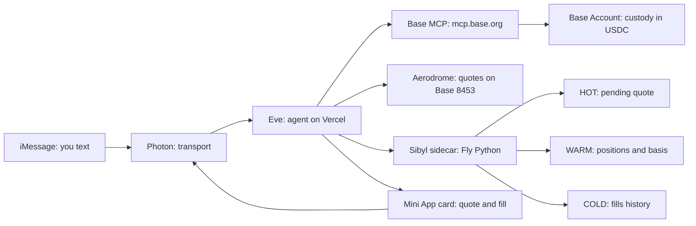

# Kiru: text to own stocks

> Buy real tokenized stocks by text message, as easy as texting a friend.

## 1. Overview

Kiru lets you buy real tokenized stocks by text message, as easy as texting a friend.

- Real money: every trade settles onchain, paper mode default until live trading is enabled.
- Live price cards: you see the price before you commit.
- You keep custody: assets live in your own Base Account, not ours.
- Outside the US only: eligibility is checked up front.

Text to start (mock): `+1 (555) 013-4472`

Send `buy $50 of NVDAc`. That is the whole onboarding.

## 2. Features

No apps. No charts. Just iMessage. No apps to install, no charts to learn, no jargon.

- **Text to trade:** text a number to buy and sell tokenized stocks with real money.
- **Live price cards:** a live price card right in the chat before you commit to anything.
- **You approve everything:** every order needs your yes, nothing ever moves without it.
- **Memory for money:** ask "what is my average cost?" anytime, Kiru remembers your holdings.
- **Cash out anytime:** cash out to dollars (USDC) whenever you want.
- **Rich mini-cards:** portfolio mini-cards, live in the conversation.
- **Right region, right start:** outside the US only, eligibility is checked up front.
- **Self-custody:** your assets live in your own account, not ours.

## 3. Architecture

One text travels the whole loop, and your memory travels with it.



## 4. Simulation

Static transcript of the mock trade. The plan page auto-plays this; here it is frozen.

> **you:** buy $50 of NVDAc
>
> **kiru:** Live price for NVDAc (approve within 30 seconds):
>
> `NVDAc · quote (30s)`
>
> `Price: $182.40`
>
> `You pay: $50.00 USDC`
>
> `You get ~: 0.2741 NVDAc`
>
> `Network fee ~: $0.04`
>
> **you:** Approve
>
> **kiru:** Filled: 0.2741 NVDAc for $50.00 USDC. Held in your Base Account.
>
> *you liked the fill receipt*
>
> **you:** what's my NVDAc basis?
>
> **kiru:** Your NVDAc basis: 0.2741 shares @ $182.40 avg, remembered by Sibyl (WARM entities/).

## 5. Sibyl

Kiru's memory is a Sibyl sidecar: three Python packages, one contract, three tiers that matter.

### Packages

| Package | Job in Kiru |
| --- | --- |
| `sibyl-memory-cli` | Activates the sidecar and manages tiers (`init`, `status`, upgrades). |
| `sibyl-memory-client` | The engine itself, local SQLite + full-text search, five-tier schema, no embeddings. |
| `sibyl-memory-mcp` | The contract Eve speaks, every memory read/write goes through this MCP server. |

### Tiers

| Tier | What Kiru keeps there |
| --- | --- |
| HOT `state/` | The live quote you have not approved yet, and the order in flight. |
| WARM `entities/` | One record per token: shares held and average cost, your basis. |
| COLD `journal/` | Every fill, append-only, the audit trail behind "what did I buy?" |

## 6. Run order

Same row runs parallel. Right column waits on the left.

| Wave | keyur (money+memory) | shreyash (surface) | Gate |
| --- | --- | --- | --- |
| 1 | #1 contracts, #4 sibyl, #5 base-mcp | #2 eve, #3 photon | #1 first, then the rest together |
| 2 | #7 balance, #8 quote, #9 plugin, #10 search | #2 eve, #3 photon | Needs wave 1 |
| 3 | #11 execute, #12 usdc | #13 card, #14 miniapp, #15 tapback, #16 polish | #13 waits on #11, the only joint |
| 4 | #17 watchlist, #18 alerts | #19 recap | #18 waits on #17 and #8 |

## 7. Issues queue

Work is tracked as issues #1-19 in GitHub, the queue:

- [Issues queue](https://github.com/keyurbodar/kiru/issues)

File the build as issues, not PRs, until each slice lands.

## 8. Tech stack

Each layer picks the managed option; custom code lives only in Eve tools.

| Layer | Choice | Why |
| --- | --- | --- |
| Runtime | Eve (TS, Vercel, Photon channel, schedules) | Least custom code: agent, channel, and cron ship together. |
| Channel | Photon (cloud iMessage numbers, Mini App cards) | Real iMessage numbers without hardware; cards for quotes. |
| Wallet | Base MCP `mcp.base.org` to user Base Account | User custody; `approvalUrl` flow keeps keys off the server. |
| Memory | Sibyl Fly Python sidecar (`cli init`, client SQLite+FTS5, `mcp` 8-tool contract) | HOT pending quote, WARM positions and basis, COLD fills journal. |
| Money | Base MCP Aerodrome plugin (Sugar CLI prepare to `send_calls` execute, USDC legs) | One approval flow: route prepared on-venue, signed in user Base Account. Price comes from the venue quote itself. |

## 9. File tree

Leaf annotations map to PR ids where known.

```text
kiru/
  plan.html
  issues #1-19 (GitHub, the queue)
  dist-plan/
  eve/
    agent/
    channels/photon.ts # PR-002
    tools/getPrice.ts # PR-008
    tools/getPosition.ts # PR-007
    tools/quoteBuy.ts # PR-008
    tools/executeBuy.ts # PR-011, PR-012
    schedules/alerts.ts # PR-018
    schedules/recap.ts # PR-019
    instructions.md # PR-001
    skills/stocks.md # PR-009
  miniapp/
    stocks/card/page.tsx # PR-014
  sibyl-sidecar/
    main.py # PR-004, PR-010
    memory.db (volume) # PR-017
  README
```

## 10. References

Source material, link list.

### Photon

- [Photon: bring your agents to iMessage and beyond](https://photon.codes/)
- [Photon docs: iMessage provider](https://photon.codes/docs/spectrum-ts/providers/imessage)
- [Photon platform: iMessage API and mini apps](https://photon.codes/platform/imessage)

### Eve

- [Eve changelog: iMessage support via the Photon channel](https://vercel.com/changelog/imessage-support-for-eve-agents)
- [Eve docs: deploying Eve agents (Vercel)](https://vercel.com/docs/connect/frameworks/eve)
- [Eve: the agent framework](https://eve.dev/)
- [Photon: Vercel Eve iMessage example](https://github.com/photon-hq/vercel-eve-imessage-example.git)

### Base, tokenized stocks, 1inch

- [Base docs: tokenized stocks guide](https://docs.base.org/base-chain/asset-issuance/tokenized-stocks-on-base)
- [Base blog: tokenized stocks are live on Base](https://blog.base.org/tokenized-stocks)
- [1inch blog: expanding to Base](https://blog.1inch.com/the-1inch-network-expands-to-base/)
- [1inch blog: Swap API for RWAs](https://1inch.com/blog/post/1inchs-swap-api-now-facilitates-rwas)

### Base MCP

- [Base docs: Base MCP quickstart](https://docs.base.org/ai-agents/quickstart)
- [Base blog: introducing Base MCP](https://blog.base.org/base-mcp)
- [base/skills: base-mcp skill](https://github.com/base/skills/blob/master/skills/base-mcp/SKILL.md)

### Sibyl

- [Sibyl Memory: docs](https://docs.sibyllabs.org/memory/)
- [PyPI: sibyl-memory-client](https://pypi.org/project/sibyl-memory-client/)
- [PyPI: sibyl-memory-cli](https://pypi.org/project/sibyl-memory-cli/)
- [PyPI: sibyl-memory-mcp](https://pypi.org/project/sibyl-memory-mcp/)
